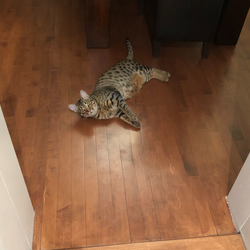

[syncat]: https://github.com/oinkiguana/syncat
[syncat stylesheets]: https://github.com/oinkiguana/syncat-themes
[oinkiguana/paper]: https://github.com/oinkiguana/paper
[ttscoff/mdless]: https://github.com/ttscoff/mdless
[lunaryorn/mdcat]: https://github.com/lunaryorn/mdcat

# Paper terminal

<!-- Here's a comment -->

See [paper.png](./paper.png) to see what this looks like!

Writes a file to a paper in your terminal. *Especially* if that file is Markdown! Features supported
include:

1.  The usual text, and paragraphs with automatic line-wrapping. You can manually wrap with  
    hard breaks as expected.

    Otherwise, paragraphs will be nicely spaced.
2.  Headings
3.  __Bold__ / *Italic* / *__Bold and Italic__* / ~~Strikethrough~~
4.  Lists
    *   Ordered
    *   Unordered
        *   Nested
5.  Rules
6.  `Inline code`
7.  Code blocks, with [syncat][] integration for syntax highlighting. Note that you must install
    syncat and make the syncat executable available on your path for this to work.
    ```rust
    fn main() {
        println!("Hello world");
    }
    ```
8.  Blockquotes

    >   Blockquotes
    >   >  And even nested block quotes

9.  And even images! Here's a photo of my cat

    

10. Task lists:
    - [x] Easy
    - [ ] Hard
11. Footnotes[^ft]

    [^ft]: This is the footnote!

12. Tables

## Comparison with other command line Markdown renderers

Not a very good comparison... this is more of an example of a table!

| Tool                 | CommonMark | Paper | Paging | Wrapping | Syntax     | Images    | Tables | Looks good\* |
| :------------------- | :--------- | :---- | :----- | :------- | :--------- | :-------- | :----- | :----------- |
| [oinkiguana/paper][] | Yes        | Yes   | No     | Yes      | syncat     | Pixelated | Yes    | Yes          |
| [ttscoff/mdless][]   | Yes        | No    | Yes    | No       | pygmentize | Sometimes | Yes    | No           |
| [lunaryorn/mdcat][]  | Yes        | No    | No     | No       | syntect    | Sometimes | No     | No           |

\* subjective

## Styling

Paper uses [syncat stylesheets][] to allow full customization of styling. See the default stylesheet (`src/default.syncat`)
as an example of how this works. To override the default styles, create `md.syncat` in your active syncat theme.

*   Different scopes are represented as nodes, inspired by the corresponding HTML tag names.

    *   `h1` through `h6`
    *   `strong`
    *   `emphasis`
    *   `strikethrough`
    *   `code`
    *   `blockquote`
    *   `ul`, `ol`, `li`
    *   `footnote-ref`, `footnote-def`, `footnote`
    *   `table`
    *   `caption`
    *   `link`

*   The paper and shadow can be matched with `paper` and `shadow`. Styles applied to `paper` are applied to everything.
*   The `"prefix"` and `"suffix"` tokens can be used to match the decorations
    *   List item bullets
    *   Blockquote markers
    *   Code block margins
*   The `"lang-tag"` token matches the language name written in the bottom corner of the code block
*   You can apply styles to code blocks with a specific language by using the language name as the token

For now, the prefix/suffix contents are not customizable, but this may be added in future if it is desired.

## Installation

Paper can be installed from crates.io using Cargo:

```bash
cargo install paper-terminal
```

## Usage

```bash
# Print the help
paper --help

# Render README.md
paper README.md

# Render README.md, with syntax highlighting
paper README.md -s
```

```
paper 0.1.0
Cameron Eldridge <cameldridge+git@gmail.com>
Prints papers in your terminal

USAGE:
    paper [FLAGS] [OPTIONS] [file]...

FLAGS:
        --dev          Print in debug mode
        --help         Prints help information
    -u, --hide-urls    Hide link URLs
    -i, --no-images    Disable drawing images
    -p, --plain        Don't parse as Markdown, just render the plain text on a paper
    -s, --syncat       Use syncat to highlight code blocks. Requires you have syncat installed.
    -V, --version      Prints version information

OPTIONS:
    -h, --h-margin <h-margin>    Horizontal margin (overrides --margin)
    -m, --margin <margin>        Margin (shortcut for horizontal and vertical margin set to the same value) [default:
                                 6]
    -v, --v-margin <v-margin>    Vertical margin (overrides --margin)
    -w, --width <width>          The width of the paper (including the space used for the margin) [default: 92]

ARGS:
    <file>...    Files to print
```
